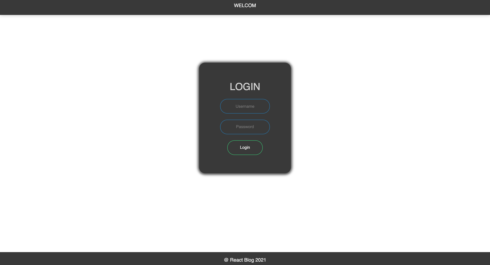
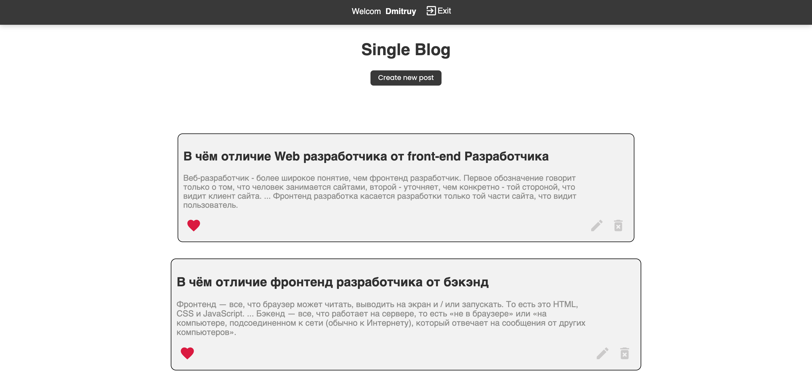
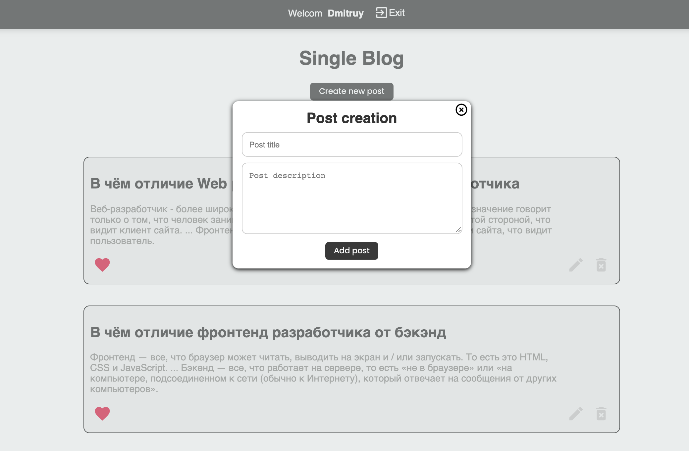

# Проект Блог на React Js :white_check_mark: :white_check_mark: :white_check_mark:

---

```
Stack :
	useState, React-router-dom, material-ui, axios, material-ui/icons
```

---

# :camera: :camera: :camera: :camera:



# :camera: :camera: :camera: :camera:



# :camera: :camera: :camera: :camera:


